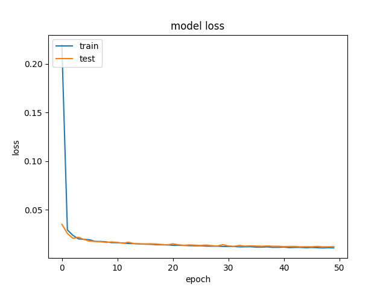

# **Behavioral Cloning** 


**Behavioral Cloning Project**

The goals / steps of this project are the following:
* Use the simulator to collect data of good driving behavior
* Build, a convolution neural network in Keras that predicts steering angles from images
* Train and validate the model with a training and validation set
* Test that the model successfully drives around track one without leaving the road
* Summarize the results with a written report


## Rubric Points
### Here I will consider the [rubric points](https://review.udacity.com/#!/rubrics/432/view) individually and describe how I addressed each point in my implementation.  

---
### Files Submitted & Code Quality

My project includes the following files:
* model.py       containing the script to create and train the model
* drive.py       for driving the car in autonomous mode
* group_norm.py  Keras module downloaded from [Group normalization](https://github.com/titu1994/Keras-Group-Normalization)
* model.h5       containing a trained convolution neural network 
* README.md      summarizing the results
* video.mp4      A video recording the vehicle driving autonomously on both track 1 and track 2.

Using the Udacity provided simulator and my drive.py file, the car can be driven autonomously around the track by executing 
```sh
python drive.py model.h5
```

The model.py file contains the code for training and saving the convolution neural network. The file shows the pipeline I used for training and validating the model, and it contains comments to explain how the code works.


### Model Architecture and Training Strategy

#### The Model
My model architecture is based on a [End-to-End Deep Learning for Self-Driving Cars](https://devblogs.nvidia.com/deep-learning-self-driving-cars/) model developped by Nvidia, which consists of 5 convolutional layers and 3 fully connected layers.


The first three convolutional layers are using 5x5 filters while the last two are using 3x3 filters (model.py line 39, 46, 51, 56, and 61).  

The model includes RELU layers to introduce nonlinearity (model.py line 43, 48, 53, 58, and 63), and the data is normalized in the model using a Keras lambda layer (model.py line 36).   

#### Overfitting
Dropout layer is not used in this project since any kind of dropout layer will somehow make the car drives out of road.  I ran a 50-epoch training test and didn't see sign of overfitting since both training loss and validation loss are similiar and drop in a very similiar rate.

Based on the above result, I decided to stop the training at 40th epoch.

#### Parameters Tunning
The model used an adam optimizer, so the learning rate was not tuned manually (model.py line 245).

#### Creating Training Data
Training data was chosen to keep the vehicle driving on the road. I used a combination of center lane driving, recovering from the left and right sides of the road.  It's worth mentioning that when creating training samples of recovering from left or right sides of the road, you eventually also teach the car to run toward the road side if you run toward the road side and recover from it.  This would add bad driving behaviors into the data set.  To solve this issue, I drived the car along either left or right side of the road and then edit the steering angle with my utility.  Any bad driving behavior will also removed from the data set.  

<table width="642" border="1" cellpadding="5">

<tr>

<td align="center" valign="center">

<br />
Edit the steering angle of recovering from the left.
</td>

<td align="center" valign="center">

<br />
Edit the steering angle of recovering from the right.
</td>

</tr>

</table>


### Model Architecture and Training Strategy

#### 1. Solution Design Approach
To enrich my training data, I flip all training data of track 1, which the car is safe to drive along the center of the lane.  

<table width="642" border="1" cellpadding="5">

<tr>

<td align="center" valign="center">

<br />
Image before flipping.
</td>

<td align="center" valign="center">

<br />
Image before flipping.
</td>

</tr>

</table>

However, images of track 2 are not flipped because I don't think it is safe to drive the car on the wrong way.

I shuffled the training samples 4 times then split them into two sets.  70% of the samples are used as training sets while 30% of them are used as validation set (model.py line 239)  This is to make sure that I don't train and validate on the same set and causes overfitting.

In the traing data generator (`trainSamplesGenerator`, model.py line 112), I add a small adjustment (-0.06, model.py line 148) to shift the car toward left a little bit to avoid hitting poles at some sharp turns. Steering angle corrections are also added to images taken by left and right cameras.  Images of the right camera are getting a little bit more correction than the left images in order to keep the car away from the poles (model.py line 150-158).

```python

                    centerCorrection = -0.06
                    leftCorrection = 0.22
                    rightCorrection = 0.24

                    steeringCenter += centerCorrection
                    steeringLeft  = steeringCenter + leftCorrection
                    steeringRight = steeringCenter - rightCorrection

````
After adjustment, over-steering samples will be discard to avoid unexpected behavior (model.py line 173-179)
````python

                    if steeringLeft >= -1.0 and steeringLeft <= 1.0:
                        images.append(nparrayLeft)
                        angles.append(steeringLeft)

                    if steeringRight >= -1.0 and steeringRight <= 1.0:
                        images.append(nparrayRight)
                        angles.append(steeringCenter)
````
Two training data generators were created to generate training and validation sets (model.py line 242-243):
````python
    train_generator = trainSamplesGenerator(shuffledRowList[0:nTrain], batchSize, loadAll=False)
    validation_generator = trainSamplesGenerator(shuffledRowList[nTrain:nRow], batchSize, loadAll=False)
````

A Keras model is created by calling a fuction `getModel` (model.py line 245) that stacked up all convolution and fully-connected layers (model.py line 31-85): 

````python
    model = getModel(imageShape, loss='mse', optimizer='adam')
````
For each convolution layer in this model, a [Group normalization](https://github.com/titu1994/Keras-Group-Normalization) layer is added to normalize the results (model.py line 42, 47, 52, 57, and 62) to make sure that essential information are not averaged out by noise such as trees, rocks, the lake, or the sky.

Then, `fit_generator` was called to train this model (model.py line 255-259)
```python
  history = model.fit_generator(train_generator, \
            steps_per_epoch=math.ceil(nTrain/batchSize), \
            validation_data=validation_generator, \
            validation_steps=math.ceil(nValid/batchSize), \
            epochs=args.epoch, verbose=1)
````
After saving the model, I ran the simulator and found the car drives out of road at some spot of track 1 and track 2.
This was either casued by bad or insufficient training data.  I removed bad behavior and added more training data.
Since all the training data points were recorded at speed of 9 mph, I added a small adjustment (drive.py line 85) proportional to current speed to drive the vehicle better through some sharp turns.
````python
      steering_angle *= (1.+float(speed)/200.)
````
The car fianlly drove along the center line of the roads at the speed of 18 mph. 

#### 2. Final Model Architecture

The final model architecture (model.py lines 18-24) consisted of a convolution neural network with the following layers and layer sizes:


#### 3. Creation of the Training Set & Training Process

To capture good driving behavior, I first recorded two laps on track one using center lane driving. Here is an example image of center lane driving:


I then recorded the vehicle driving along both left side and right side of the road instead of back and forth between center of the road and road sides.  This is to avoid accidentally adding bad driving behavior into the data set.  All the recovery data are then edited by my utility to teach the car what to do when approaching the road sides:


After the collection process, I had 584967 of data points. All training data were then preproccessed to cut off portions of sky and the hood.  The size of images then changed from 160x320 to 71x320:

<table width="642" border="1" cellpadding="5">

<tr>

<td align="center" valign="center">

<br />
Image before cropping.
</td>

<td align="center" valign="center">

<br />
Image after cropping.
</td>

</tr>

</table>

I used this training data for training the model. The validation set helped determine if the model was over or under fitting. The ideal number of epochs was 40 as evidenced by running a 50-epoch test (shown previously). I used an adam optimizer so that manually training the learning rate wasn't necessary. To speed up training time, I also set the batch size to 2048 that just fits into Nvidia RTX-2080 Ti on my linux server. By watching video.mov, we can see the vehicle runs at the center line of track 1 and center line of right lane of track 2.

#### Future Improvements

Some of the trainings's loss might somehow be stuck at 0.09. Currently, I simply kill the process and restart it to get around this issue.  This should be one of the issues to be resolved in the future. 


```python

```
